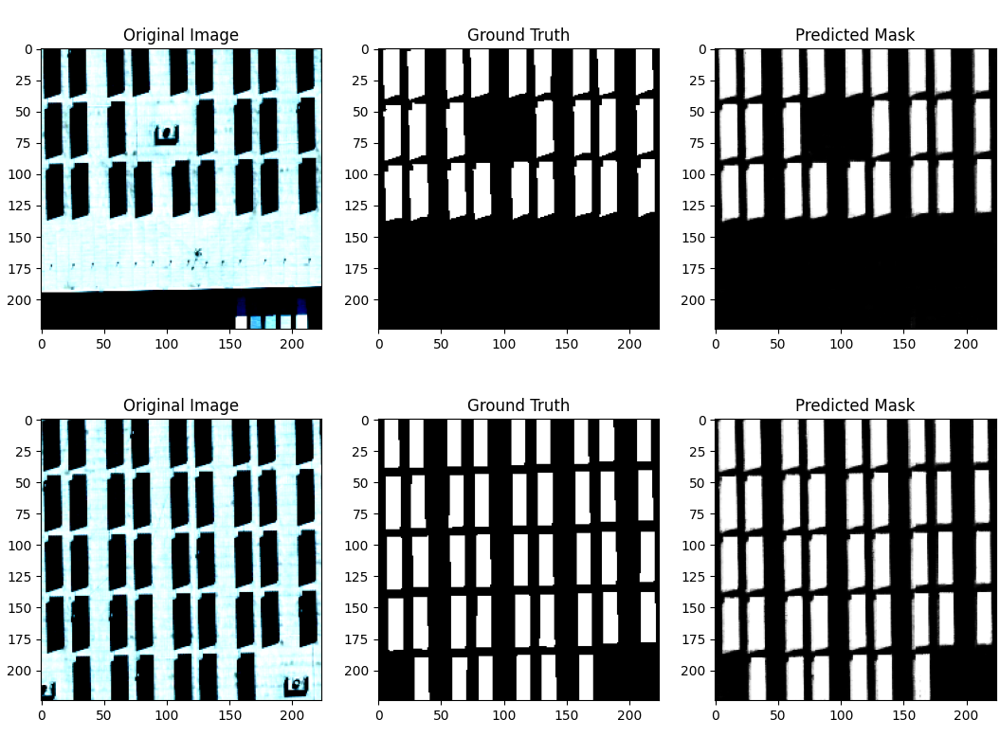

# solar-panel-detection-segmentation
CNN model to detect and segment solar panels in satellite photos


Run In Colab:
[](https://colab.research.google.com/github/i1idan/solar-panel-detection-segmentation/blob/main/Solar_Panel_Recog.ipynb)


## Datasets:
1- Modesto: Modesto Aerial USGS Imagery from the Distributed Solar Photovoltaic Array Location and Extent Data Set
https://figshare.com/ndownloader/articles/3385789/versions/1

2- Oxnard: Oxnard Aerial USGS Imagery from the Distributed Solar Photovoltaic Array Location and Extent Data Set
https://figshare.com/ndownloader/articles/3385807/versions/1


## Results

```bash
----------------------------------------------------------------------------------------------------

Train loss: 0.025982853078810302, Train AUC ROC: 0.9990211825496326, Train Accuracy: 0.9925819080980837

Val loss: 0.24260339476168155, Val AUC ROC: 0.9795678459471563, Val Accuracy: 0.93354943273906
----------------------------------------------------------------------------------------------------
```


```bash

Train loss: 0.04034481899191936, Val loss: 0.02698821760714054
dice coefficient: 0.9125192510124607
```

